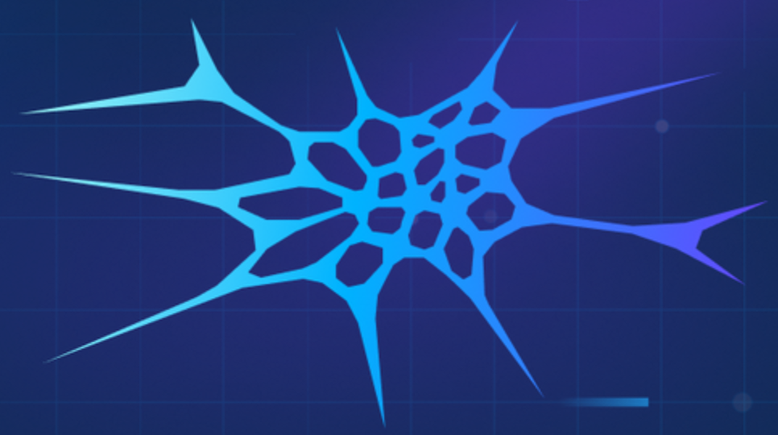

<!-- Modern gradient banner with subtle animation -->

  

<!-- Animated Typing Header -->

  

  <!-- Social and quick stats badges (glass chips) -->
  

    <table style="width:100%; min-width:760px; border-collapse:separate; border-spacing:10px;">
      <tr>
        <td align="center" style="background: rgba(255,255,255,0.10); border: 1px solid rgba(255,255,255,0.25); border-radius:12px; padding:6px;">
          
        </td>
        <td align="center" style="background: rgba(255,255,255,0.10); border: 1px solid rgba(255,255,255,0.25); border-radius:12px; padding:6px;">
          
        </td>
        <td align="center" style="background: rgba(255,255,255,0.10); border: 1px solid rgba(255,255,255,0.25); border-radius:12px; padding:6px;">
          
        </td>
        <td align="center" style="background: rgba(255,255,255,0.10); border: 1px solid rgba(255,255,255,0.25); border-radius:12px; padding:6px;">
          
        </td>
      </tr>
    </table>
  

---

## About Me

Final year Computer Science Engineering student specializing in Artificial Intelligence, with a strong focus on software development 
and innovative AI-driven solutions. Passionate about designing practical, impactful systems that bridge technology and creativity. 

## Skills

  <table style="width:100%; border-collapse:separate; border-spacing:8px;">
    <!-- Row 1 (10) -->
    <tr>
      <td align="center" style="width:10%; background: rgba(255,255,255,0.12); border: 1px solid rgba(255,255,255,0.25); border-radius:14px; padding:8px; white-space:nowrap;">  Python</td>
      <td align="center" style="width:10%; background: rgba(255,255,255,0.12); border: 1px solid rgba(255,255,255,0.25); border-radius:14px; padding:8px; white-space:nowrap;">  C/C++</td>
      <td align="center" style="width:10%; background: rgba(255,255,255,0.12); border: 1px solid rgba(255,255,255,0.25); border-radius:14px; padding:8px; white-space:nowrap;">  JavaScript</td>
      <td align="center" style="width:10%; background: rgba(255,255,255,0.12); border: 1px solid rgba(255,255,255,0.25); border-radius:14px; padding:8px; white-space:nowrap;">  TypeScript</td>
      <td align="center" style="width:10%; background: rgba(255,255,255,0.12); border: 1px solid rgba(255,255,255,0.25); border-radius:14px; padding:8px; white-space:nowrap;">  SQL</td>
      <td align="center" style="width:10%; background: rgba(255,255,255,0.12); border: 1px solid rgba(255,255,255,0.25); border-radius:14px; padding:8px; white-space:nowrap;">  HTML5</td>
      <td align="center" style="width:10%; background: rgba(255,255,255,0.12); border: 1px solid rgba(255,255,255,0.25); border-radius:14px; padding:8px; white-space:nowrap;">  CSS3</td>
      <td align="center" style="width:10%; background: rgba(255,255,255,0.12); border: 1px solid rgba(255,255,255,0.25); border-radius:14px; padding:8px; white-space:nowrap;"> Tailwind</td>
      <td align="center" style="width:10%; background: rgba(255,255,255,0.12); border: 1px solid rgba(255,255,255,0.25); border-radius:14px; padding:8px; white-space:nowrap;">  Angular</td>
      <td align="center" style="width:10%; background: rgba(255,255,255,0.12); border: 1px solid rgba(255,255,255,0.25); border-radius:14px; padding:8px; white-space:nowrap;"> React</td>
    </tr>
    <!-- Row 2 (10) -->
    <tr>
      <td align="center" style="width:10%; background: rgba(255,255,255,0.12); border: 1px solid rgba(255,255,255,0.25); border-radius:14px; padding:8px; white-space:nowrap;">  Bootstrap</td>
      <td align="center" style="width:10%; background: rgba(255,255,255,0.12); border: 1px solid rgba(255,255,255,0.25); border-radius:14px; padding:8px; white-space:nowrap;">  FastAPI</td>
      <td align="center" style="width:10%; background: rgba(255,255,255,0.12); border: 1px solid rgba(255,255,255,0.25); border-radius:14px; padding:8px; white-space:nowrap;">  SQLite</td>
      <td align="center" style="width:10%; background: rgba(255,255,255,0.12); border: 1px solid rgba(255,255,255,0.25); border-radius:14px; padding:8px; white-space:nowrap;">  REST&nbsp;APIs</td>
      <td align="center" style="width:10%; background: rgba(255,255,255,0.12); border: 1px solid rgba(255,255,255,0.25); border-radius:14px; padding:8px; white-space:nowrap;">  FAISS</td>
      <td align="center" style="width:10%; background: rgba(255,255,255,0.12); border: 1px solid rgba(255,255,255,0.25); border-radius:14px; padding:8px; white-space:nowrap;">  Weaviate</td>
      <td align="center" style="width:10%; background: rgba(255,255,255,0.12); border: 1px solid rgba(255,255,255,0.25); border-radius:14px; padding:8px; white-space:nowrap;">  Git</td>
      <td align="center" style="width:10%; background: rgba(255,255,255,0.22); border: 1px solid rgba(255,255,255,0.35); border-radius:14px; padding:8px; white-space:nowrap;">  GitHub</td>
      <td align="center" style="width:10%; background: rgba(255,255,255,0.12); border: 1px solid rgba(255,255,255,0.25); border-radius:14px; padding:8px; white-space:nowrap;">  VS&nbsp;Code</td>
      <td align="center" style="width:10%; background: rgba(255,255,255,0.12); border: 1px solid rgba(255,255,255,0.25); border-radius:14px; padding:8px; white-space:nowrap;">  Canva</td>
    </tr>
  </table>

## Experience Snapshot

- <b>Data Analyst Intern</b> — Escorts Kubota Ltd. (Jul’25–Sep’25)  
  Built dynamic Qlik Sense dashboards, optimized data pipelines, accelerated insights by ~25%.
- <b>Software Developer Intern</b> — IIT Kharagpur (Jun’25–Jul’25)  
  AI healthcare assistant on medical datasets; boosted diagnostic interpretation accuracy to ~90% using FastAPI, Angular, and LLMs.

## Education

- B.Tech CSE — HMR Institute of Technology & Management, Delhi (2022–2026) — CGPA: 8.76

## Highlighted Projects

- <b>AI Developer Onboarding Engine (Multi‑Agent AI System)</b> — FastAPI, React, LangChain, Python, Weaviate, Docker  
  Automated 7‑agent onboarding: setup, diagnostics, CI/CD, feedback, and walkthroughs; improved onboarding efficiency by ~60%.
- <b>ClimaSense (Weather Monitor)</b> — HTML/CSS/JS, OpenWeatherMap API  
  Real‑time weather app with graphs, async fetch, and error‑handling.
- <b>Recipe Explorer (API‑based Recipe Finder)</b> — HTML/CSS/JS, Spoonacular API  
  Search by ingredients, health labels, and time with smooth UX.
- <b>Resort Landing Page</b> — HTML/CSS/JS  
  Modern responsive landing page with parallax and glass‑morphism.

## GitHub Stats

  <table style="width:100%; min-width:1080px; border-collapse:separate; border-spacing:12px;">
    <tr>
      <td align="center" style="width:33.33%; background: rgba(255,255,255,0.08); border: 1px solid rgba(255,255,255,0.25); border-radius:14px; padding:8px;">
        
      </td>
      <td align="center" style="width:33.33%; background: rgba(255,255,255,0.08); border: 1px solid rgba(255,255,255,0.25); border-radius:14px; padding:8px;">
        
      </td>
      <td align="center" style="width:33.33%; background: rgba(255,255,255,0.08); border: 1px solid rgba(255,255,255,0.25); border-radius:14px; padding:8px;">
        
      </td>
    </tr>
  </table>

## 3D Contribution Graph

<!-- The image below is generated by a GitHub Action included in this repo -->

## Extras

  
<b>What I’m focusing on</b>

  - Building RAG systems with FAISS/Weaviate and prompt‑guarded LLM agents  
  - Data viz pipelines (Qlik/SQL/ETL) and robust REST APIs with FastAPI  
  - Frontend craft with Angular/React + Tailwind

---

  
   
  Made with &hearts; by <a href="https://github.com/somntiwary">Sompriya</a>
   
  Tip: Replace <code>somntiwary</code> with your username if you fork this.

