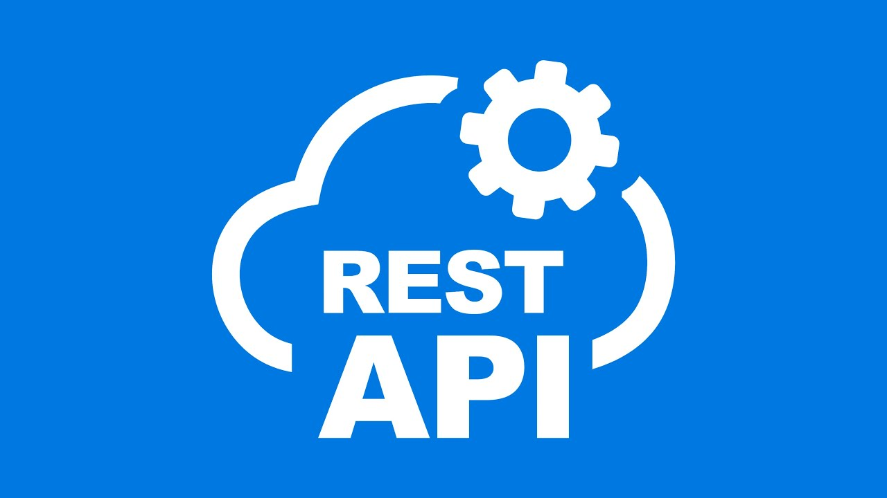
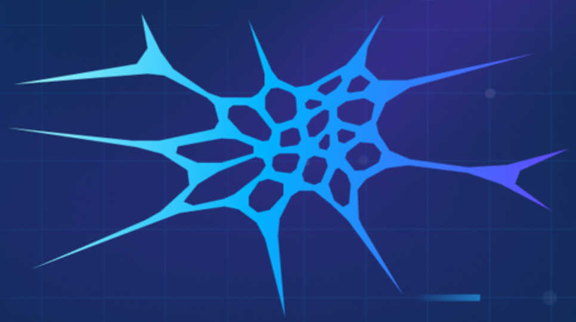

<!-- Modern gradient banner with subtle animation -->

  

<!-- Animated Typing Header -->

  

  <!-- Social and quick stats badges (glass chips) -->

  

    <table style="width:100%; min-width:760px; border-collapse:separate; border-spacing:10px;">
      <tr>
        <td align="center" style="background: rgba(255,255,255,0.10); border: 1px solid rgba(255,255,255,0.25); border-radius:12px; padding:6px;">
          
        </td>
        <td align="center" style="background: rgba(255,255,255,0.10); border: 1px solid rgba(255,255,255,0.25); border-radius:12px; padding:6px;">
          
        </td>
        <td align="center" style="background: rgba(255,255,255,0.10); border: 1px solid rgba(255,255,255,0.25); border-radius:12px; padding:6px;">
          
        </td>
        <td align="center" style="background: rgba(255,255,255,0.10); border: 1px solid rgba(255,255,255,0.25); border-radius:12px; padding:6px;">
          
        </td>
      </tr>
    </table>
  

## 👋 About Me

I'm a **Computer Science & Engineering graduate specializing in Artificial Intelligence**, enrolled in the **M.Sc. Computational Sciences** programme at **Freie Universität Berlin** for **Winter Semester 2026/27**.

I build and evaluate **agentic AI systems**, **retrieval-augmented generation (RAG) applications**, and **data-driven software**. Through internships at **DRDO–SSPL**, **IIT Kharagpur**, and **Escorts Kubota**, I've worked on AI-assisted workflows, medical document processing, backend APIs, and manufacturing analytics.

My core tools include **Python, FastAPI, LangGraph, LangChain, FAISS, Ollama, and PostgreSQL**. I focus on prompt iteration, agent testing, failure analysis, and turning data into practical applications.

| At a glance | Details |
| :--- | :--- |
| **Seeking** | AI / Machine Learning / Software Development working-student opportunities. |
| **Availability** | From **1 October 2026** · **20 hours/week** during the semester. |
| **Languages** | English · German (A1). |

---

## 💻 Skills

  <table style="width:100%; border-collapse:separate; border-spacing:8px;">
    <!-- Row 1 (10) -->
    <tr>
      <td align="center" style="width:10%; background: rgba(255,255,255,0.12); border: 1px solid rgba(255,255,255,0.25); border-radius:14px; padding:8px; white-space:nowrap;">  Python</td>
      <td align="center" style="width:10%; background: rgba(255,255,255,0.12); border: 1px solid rgba(255,255,255,0.25); border-radius:14px; padding:8px; white-space:nowrap;">  C/C++</td>
      <td align="center" style="width:10%; background: rgba(255,255,255,0.12); border: 1px solid rgba(255,255,255,0.25); border-radius:14px; padding:8px; white-space:nowrap;">  JavaScript</td>
      <td align="center" style="width:10%; background: rgba(255,255,255,0.12); border: 1px solid rgba(255,255,255,0.25); border-radius:14px; padding:8px; white-space:nowrap;">  TypeScript</td>
      <td align="center" style="width:10%; background: rgba(255,255,255,0.12); border: 1px solid rgba(255,255,255,0.25); border-radius:14px; padding:8px; white-space:nowrap;">  SQL</td>
      <td align="center" style="width:10%; background: rgba(255,255,255,0.12); border: 1px solid rgba(255,255,255,0.25); border-radius:14px; padding:8px; white-space:nowrap;">  HTML5</td>
      <td align="center" style="width:10%; background: rgba(255,255,255,0.12); border: 1px solid rgba(255,255,255,0.25); border-radius:14px; padding:8px; white-space:nowrap;">  CSS3</td>
      <td align="center" style="width:10%; background: rgba(255,255,255,0.12); border: 1px solid rgba(255,255,255,0.25); border-radius:14px; padding:8px; white-space:nowrap;">  Tailwind</td>
      <td align="center" style="width:10%; background: rgba(255,255,255,0.12); border: 1px solid rgba(255,255,255,0.25); border-radius:14px; padding:8px; white-space:nowrap;">  Angular</td>
      <td align="center" style="width:10%; background: rgba(255,255,255,0.12); border: 1px solid rgba(255,255,255,0.25); border-radius:14px; padding:8px; white-space:nowrap;">  React</td>
    </tr>
    <!-- Row 2 (10) -->
    <tr>
      <td align="center" style="width:10%; background: rgba(255,255,255,0.12); border: 1px solid rgba(255,255,255,0.25); border-radius:14px; padding:8px; white-space:nowrap;">  Bootstrap</td>
      <td align="center" style="width:10%; background: rgba(255,255,255,0.12); border: 1px solid rgba(255,255,255,0.25); border-radius:14px; padding:8px; white-space:nowrap;">  FastAPI</td>
      <td align="center" style="width:10%; background: rgba(255,255,255,0.12); border: 1px solid rgba(255,255,255,0.25); border-radius:14px; padding:8px; white-space:nowrap;">  SQLite</td>
      <td align="center" style="width:10%; background: rgba(255,255,255,0.12); border: 1px solid rgba(255,255,255,0.25); border-radius:14px; padding:8px; white-space:nowrap;">  REST&nbsp;APIs</td>
      <td align="center" style="width:10%; background: rgba(255,255,255,0.12); border: 1px solid rgba(255,255,255,0.25); border-radius:14px; padding:8px; white-space:nowrap;">  FAISS</td>
      <td align="center" style="width:10%; background: rgba(255,255,255,0.12); border: 1px solid rgba(255,255,255,0.25); border-radius:14px; padding:8px; white-space:nowrap;">  Weaviate</td>
      <td align="center" style="width:10%; background: rgba(255,255,255,0.12); border: 1px solid rgba(255,255,255,0.25); border-radius:14px; padding:8px; white-space:nowrap;">  Git</td>
      <td align="center" style="width:10%; background: rgba(255,255,255,0.22); border: 1px solid rgba(255,255,255,0.35); border-radius:14px; padding:8px; white-space:nowrap;">  GitHub</td>
      <td align="center" style="width:10%; background: rgba(255,255,255,0.12); border: 1px solid rgba(255,255,255,0.25); border-radius:14px; padding:8px; white-space:nowrap;">  VS&nbsp;Code</td>
      <td align="center" style="width:10%; background: rgba(255,255,255,0.12); border: 1px solid rgba(255,255,255,0.25); border-radius:14px; padding:8px; white-space:nowrap;">  Canva</td>
    </tr>
  </table>

## 💼 Experience Snapshot

### Defense Research and Development Organization (DRDO-SSPL)

**Software Developer Intern** · `Jan 2026 - May 2026`

- Built a **Python/FastAPI and PostgreSQL** workflow platform with REST APIs, relational data models, **role-based access control**, task dependencies, and approval workflows.
- Integrated a locally hosted **Ollama assistant** for contextual retrieval and workflow support; tested AI/API behaviour and documented deployment in a secure on-premises environment.

### Escorts Kubota Limited

**Data Analyst Intern** · `Jul 2025 - Sep 2025`

- Cleaned, structured, and validated manufacturing datasets, and improved **ETL and analytical data-modeling workflows**.
- Translated stakeholder requirements into **Qlik Sense dashboards**, reducing insight-generation time by **25%**.

### IIT Kharagpur

**Software Developer Intern – AI Healthcare** · `Jun 2025 - Jul 2025`

- Developed **MedIVA**, combining a **RAG medical chatbot** with an automated diagnosis-report analyzer using Python, FastAPI, LangChain, FAISS, Sentence Transformers, OCR, NLP, and SQLite.
- Implemented report-text preprocessing and a **BERT-based classifier** that achieved **96.9% accuracy on project evaluation data**.
- Connected AI services to an **Angular interface** through REST APIs.

---

## 🎓 Education

### Freie Universität Berlin

**M.Sc. Computational Sciences**

Enrolled for **Winter Semester 2026/27** · Expected graduation: **2028**.

### Guru Gobind Singh Indraprastha University

**B.Tech Computer Science & Engineering (Artificial Intelligence)**

HMR Institute of Technology & Management, Delhi  
**2022 - 2026** · **CGPA:** `8.87/10`

---

## 🚀 Highlighted Projects

### SupportGuard AI

> **Agentic Customer-Support Evaluator**

**Tech:** `Python` · `FastAPI` · `LangGraph` · `Ollama` · `PostgreSQL` · `React`

- Built an evaluation application that **simulates user-agent conversations** and detects **failure modes and edge cases**.
- Supports **trace-level output review** and exports structured findings as **PDF and CSV reports**.

### AI Developer Onboarding Engine

> **Seven-Agent Developer Enablement System**

**Tech:** `Python` · `FastAPI` · `LangChain` · `Weaviate` · `Docker` · `React`

Created coordinated agent workflows for **repository analysis**, **environment setup**, **documentation**, **CI/CD workflow analysis**, and **contextual Q&A** over project knowledge.

### ResortEscape AI

> **Full-Stack Resort Booking Platform**

**Tech:** `React.js` · `Node.js` · `Express.js` · `MongoDB`

Built a booking platform with **live listings**, **real-time rate comparison**, **JWT authentication**, and **Razorpay payment integration**.

---

## GitHub Stats

  <table style="width:100%; min-width:1080px; border-collapse:separate; border-spacing:12px;">
    <tr>
      <td align="center" style="width:33.33%; background: rgba(255,255,255,0.08); border: 1px solid rgba(255,255,255,0.25); border-radius:14px; padding:8px;">
        
      </td>
      <td align="center" style="width:33.33%; background: rgba(255,255,255,0.08); border: 1px solid rgba(255,255,255,0.25); border-radius:14px; padding:8px;">
        
      </td>
      <td align="center" style="width:33.33%; background: rgba(255,255,255,0.08); border: 1px solid rgba(255,255,255,0.25); border-radius:14px; padding:8px;">
        
      </td>
    </tr>
  </table>

## 3D Contribution Graph

<!-- The image below is generated by a GitHub Action included in this repo -->

## 🎯 What I’m Focusing On

- **Agentic AI:** Building agentic AI systems with `LangGraph`, `LangChain`, and `Ollama`.
- **RAG & Document AI:** Developing applications using `FAISS`, `Sentence Transformers`, OCR, and NLP.
- **AI Reliability:** Improving AI reliability through prompt iteration, agent testing, trace review, and failure analysis.
- **Backend Engineering:** Creating `Python/FastAPI` backends with `PostgreSQL`, REST APIs, and role-based access control.
- **Frontend Integration:** Connecting AI services to practical `React` and `Angular` interfaces.

---

  
   
  Made with &hearts; by <a href="https://github.com/somntiwary">Sompriya</a>
   
  Tip: Replace <code>somntiwary</code> with your username if you fork this.

